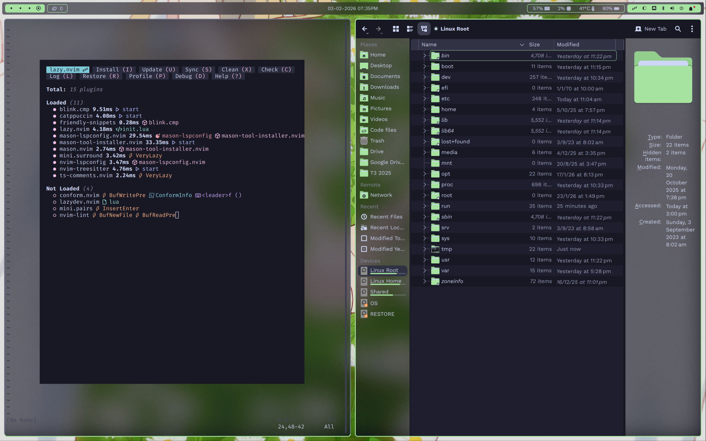
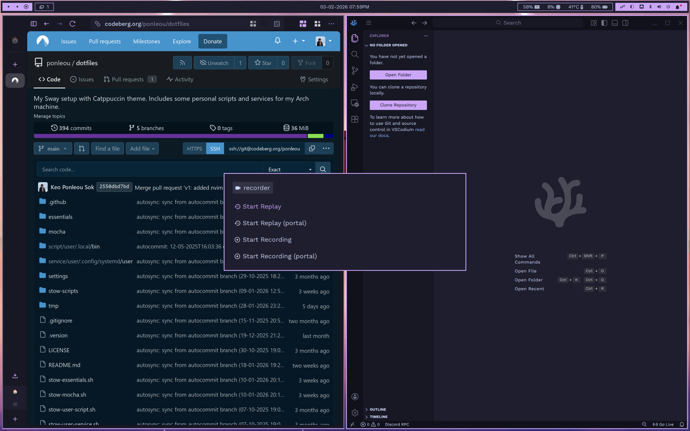

# SwayFX Dotfiles (Arch Linux and Catppuccin)

My highly customisable rice for my Arch Linux + SwayFX machine based on Catppuccin colour palette. Possibly overengineered for modularity in extensible colour palettes, accents, and mods, with automatic scripts and services. Feel free to take inspiration or copy for yourself.

## Screenshots






## Features

### Supported Applications

- QT and GTK themes
- Alacritty
- Dolphin
- Neovim
- btop
- Vesktop
- VSCode and VSCodium
- Zen Browser
- Rofi
- SwayFX
- swaylock
- SwayNC
- WayBar
- wlogout

### Theming

- Catppuccin Mocha: green, mauve, peach, rosewater, sapphire, and yellow
- Mods:
  - background: solid, blur
  - gap: big, small, none, etc.
  - rounded: all, minimal, none, etc.

_(and more to come)_

## Keybinds

> **Note:** `$mod` is set to `Mod4` (Super key)

### General

| Keybind                          | Action                                                      |
| -------------------------------- | ----------------------------------------------------------- |
| `$mod + Q`                       | Kill focused window                                         |
| `$mod + Shift + Escape`          | Reload Sway configuration                                   |
| `$mod + Shift + E`               | Exit Sway (with confirmation)                               |
| `$mod + H`                       | Split horizontally                                          |
| `$mod + G`                       | Split vertically                                            |
| `$mod + Return`                  | Toggle split layout                                         |
| `$mod + F`                       | Toggle fullscreen                                           |
| `$mod + Shift + F`               | Toggle floating mode                                        |
| `$mod + Shift + T`               | Toggle sticky window                                        |
| `$mod + LMB` (drag)              | Move floating window                                        |
| `$mod + RMB` (drag)              | Resize window                                               |
| `$mod + R`                       | Enter resize mode                                           |
| `Left` (in resize mode)          | Shrink width                                                |
| `Right` (in resize mode)         | Grow width                                                  |
| `Up` (in resize mode)            | Shrink height                                               |
| `Down` (in resize mode)          | Grow height                                                 |
| `Return/Escape` (in resize mode) | Exit resize mode                                            |
| `$mod + A`                       | Focus left                                                  |
| `$mod + S`                       | Focus down                                                  |
| `$mod + W`                       | Focus up                                                    |
| `$mod + D`                       | Focus right                                                 |
| `$mod + Left`                    | Move window left                                            |
| `$mod + Down`                    | Move window down                                            |
| `$mod + Up`                      | Move window up                                              |
| `$mod + Right`                   | Move window right                                           |
| `$mod + 1-9/0`                   | Switch to workspace 1-10                                    |
| `$mod + X`                       | Go to next workspace (in loop)                              |
| `$mod + Z`                       | Go to previous workspace (in loop)                          |
| `$mod + Ctrl + X`                | Go to next workspace (create workspace if end)              |
| `$mod + Ctrl + Z`                | Go to previous workspace (create workspace if end)          |
| `$mod + Shift + 1-9/0`           | Move window to workspace 1-10                               |
| `$mod + Shift + X`               | Move window to next workspace (create workspace if end)     |
| `$mod + Shift + Z`               | Move window to previous workspace (create workspace if end) |
| `$mod + Tab`                     | Move focused window to scratchpad                           |
| `$mod + Shift + Tab`             | Show/cycle scratchpad windows                               |

### Applications

| Keybind         | Action                           |
| --------------- | -------------------------------- |
| `$mod + T`      | Open terminal (Konsole)          |
| `$mod + Space`  | Open application launcher (Rofi) |
| `$mod + E`      | Open file manager (Dolphin)      |
| `$mod + V`      | Open clipboard history (Rofi)    |
| `$mod + Period` | Open emoji picker (Rofi)         |
| `$mod + P`      | Open wallpaper selector          |
| `$mod + C`      | Open calculator (Rofi)           |
| `$mod + Y`      | Open screen recorder (Rofi)      |
| `Print`         | Take screenshot                  |
| `$mod + Print`  | Take focused window screenshot   |

### Device-specific

| Keybind                 | Action                   |
| ----------------------- | ------------------------ |
| `XF86Launch1`           | Take screenshot          |
| `$mod + XF86Launch1`    | Take window screenshot   |
| `XF86AudioMute`         | Toggle mute              |
| `XF86AudioLowerVolume`  | Decrease volume (5%)     |
| `XF86AudioRaiseVolume`  | Increase volume (5%)     |
| `XF86AudioMicMute`      | Toggle microphone mute   |
| `XF86AudioPlay`         | Play media               |
| `XF86AudioPause`        | Pause media              |
| `XF86AudioNext`         | Next track               |
| `XF86AudioPrev`         | Previous track           |
| `XF86MonBrightnessDown` | Decrease brightness (5%) |
| `XF86MonBrightnessUp`   | Increase brightness (5%) |

## Additional Information

### Dependencies (may not be complete)

- nwg-look
- catppuccin-gtk-theme-mocha
- libadwaita-without-adwaita-git
- qt6ct-kde
- papirus-folders-catppuccin-git
- papirus-icon-theme
- darkly
- xdg-desktop-portal-gtk
- zsh-syntax-highlighting

Fonts:

- ttf-work-sans
- ttf-firacode-nerd
- ttf-nerd-fonts-symbols
- otf-font-awesome
- woff2-font-awesome

Neovim:

- tree-sitter-cli (nvim-treesitter)
- luarocks (lazy.nvim)
- libtexprintf (render-markdown.nvim)

Optional:

- autotiling
- gpu-screen-record
- cliphist
- oh-my-zsh
- rofi-emoji
- rofi-file-browser-extended-patched
- rofi-calc

### Directory Structure

```
ROOT
├── stows/
│   ├── script/                                             # Contains stow packages for personal scripts
│   ├── service/                                            # Contains stow packages for personal systemd services
│   │
│   ├── essentials/
│   │   ├── bases/                                          # STOW TARGET—Stowed from [theme]'s BASE PACKAGES, extension files for essential's STOW PACKAGES
│   │   ├── build/                                          # Build scripts for dynamic configs
│   │   └── [package]/                                      # STOW PACKAGES—Stowed to $HOME, independent from themes
│   │
│   └── [theme] (e.g. mocha, latte)/
│       ├── base/
│       │   ├── [package]/                                  # STOW PACKAGES—Stowed to $HOME, standalone theme configs (doesn't require accent)
│       │   └── [*-base]/                                   # BASE PACKAGES—Stowed to essentials/bases/
│       │
│       ├── accents/
│       │   └── [accent] (e.g. yellow, peach, etc.)/
│       │       └── [package]/                              # STOW PACKAGES—Stowed to $HOME, dependent on accent
│       │       └── [*-option]/                             # OPTION PACKAGES—Stowed to [theme]/options/
│       │
│       ├── modlist/
│       │   └── [mods] (e.g. background, gap, etc.)/
│       │       └── [mod-option]/
│       │           └── [mod-package]/
│       │               └── FILES                           # MOD FILES—Stowed to [theme]/mods/[mod-package]
│       │
│       ├── mods/
│       │   └── [mod-package]/
│       │       └── FILES                                   # STOW TARGET—Stowed from [theme]'s [mod-package]/FILES, are active mod symlinks
│       │
│       ├── options/                                        # STOW TARGET—Stowed from [theme]'s OPTION PACKAGES, extension files for [theme]
│       └── build/                                          # Build scripts for dynamic theme-dependent configs
│
├── settings/                                           # Active config accents and mods
├── service-scripts/                                    # Git automation scripts (used by pon-autocommit-stow systemd service)
├── tmp/                                                # Runtime temp files for automation scripts and services (pon-autocommit-stow)
└── assets/                                             # Assets (e.g. image files) for README.md
```

### Notes:

- Built config files, that are built with build scripts, contains a base template in \*.build
- for Vesktop config packages, stow only owns the vesktop/settings/ directory
- for YouTube Music config packages, stow only owns the "YouTube Music"/config.json and /[theme].css files
- for Code and VSCodium config packages, stow only owns the Code/User/settings.json file (along with its \*.build file), and necessary extensions must be installed manually
- `nwc` in modlist options stands for "no WayBar corners"
